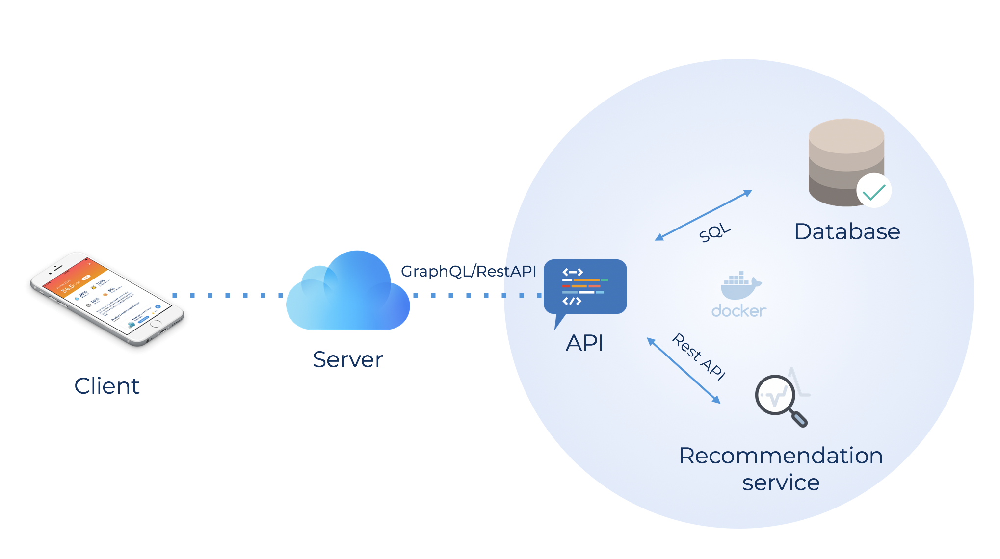

# GeonGang

GeonGang is a diagnostic/tracking system made for the skin. It is meant to work with a 
compatible sensor that reads the data of the skin then analyze and make the verdict — the recommendation system to assist the user in their journey of improving the health and 
appearance of the skin. 

## Tools and libraries

## Architechture

## Demo

